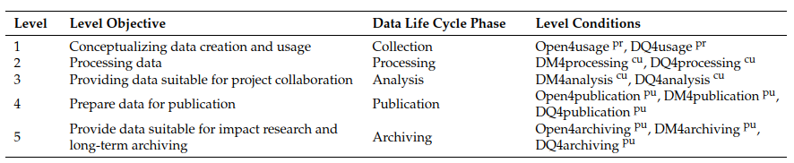
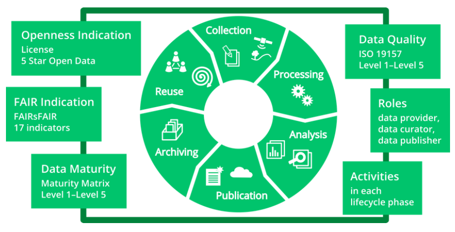
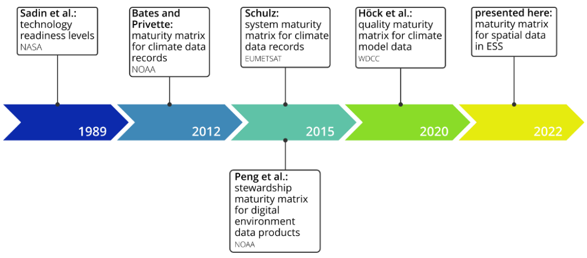

# README

## 5min Presentation 18.09.2023

### The following questions must be answered

#### 1. Why it was selected?

I chose this paper because it provides knowledge which might be relevant for my thesis. Also it serves as a great use-case for the purpose of this lecture.

#### 2. What is it about

Title: **Quality Assurance for Spatial Research Data**

Level 1: The authors propose a grading system for spatial data sources in In Earth System Sciences (ESS). The grading is 1-5 stars.

E.g.: The authors rate the SPAM2010 dataset 3.5 out of 5 stars.

Level 2: For spatial data sources in In Earth System Sciences (ESS), the authors propose a spatial data quality matrix (like a framework), that relates the data maturity levels to quality metrics. The maturity and quality levels are then assigned to the phases of the data life cycle.

#### 3. What is the flow of the structure of the paper?

Relate the structure of your paper to slide 15 on [Structure of Research Article](./1-CTCS-OverviewTask-120923.pdf).

#### 4. Is it an article, review or what?

It is an article, because it said so in the top of the paper.

#### 5. Unambiguous Url (or DOI)

[DOI: 10.3390/ijgi11060334](https://www.researchgate.net/publication/361076438_Quality_Assurance_for_Spatial_Research_Data)

## Main Messages

1. The authors  present concepts and a workflow to assure the quality of ESS (Earth System Sciences) data with the outcome of a rating in the range of 1-5 (stars)
2. The workflow is designed along the research **data life cycle** and includes criteria for **openness**, **FAIRness of data** (findable, accessible, interoperable, reusable), **data maturity**, and **data quality**
3. The authors propose a revised **maturity matrix including a list of FAIR criteria** and **a spatial data quality matrix** which relates the maturity levels to quality metrics. The **quality and maturity levels are then assigned to the phases of the data lifecycle**.
4. The authors implement an interactive questionnaire in the tool RDMO (research data management organizer)
5. The authors rate the SPAM2010 (crop distribution) dataset a 3,5 Stars out of 5 as a proof of concept of their workflow

### Process

1. Assess openness
2. Assess maturity (FAIRness findable, accessible, interoperable, reusable)
3. Assess quality
4. Comprise rating (1-5) by openness, maturity and quality

